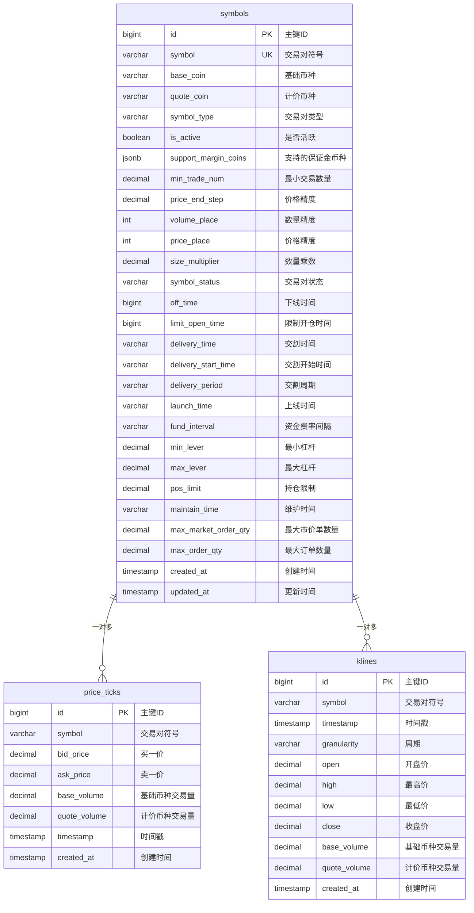

# 数据库 ER 图

## 概述

本文档描述了 CryptoSignal Hunter 系统的数据库表结构和关系图。

## 数据库架构

### 核心表结构

系统包含3个核心表，支持加密货币合约交易数据的存储和查询：

1. **symbols** - 交易对信息表
2. **price_ticks** - 实时价格数据表（TimescaleDB超表）
3. **klines** - K线数据表（TimescaleDB超表）

## ER 图



## 表关系说明

### 1. symbols 表（交易对信息表）

**作用**: 存储所有支持的交易对信息

**特点**:
- 主键: `id` (自增)
- 唯一键: `symbol` (交易对符号)
- 包含完整的BitGet API字段
- 支持软删除 (`is_active` 字段)
- 支持JSON字段存储复杂数据

**关键字段**:
- `symbol`: 交易对符号 (如 "BTCUSDT")
- `base_coin`: 基础币种 (如 "BTC")
- `quote_coin`: 计价币种 (如 "USDT")
- `symbol_type`: 交易对类型 (如 "perpetual")
- `is_active`: 是否活跃 (软删除标记)

### 2. price_ticks 表（实时价格数据表）

**作用**: 存储实时价格数据，支持高频写入

**特点**:
- TimescaleDB超表，按时间分片
- 7天分片间隔
- 7天后自动压缩
- 30天后自动删除
- 支持高并发写入

**关键字段**:
- `symbol`: 关联交易对
- `bid_price`: 买一价
- `ask_price`: 卖一价
- `base_volume`: 基础币种交易量
- `quote_volume`: 计价币种交易量
- `timestamp`: 数据时间戳

### 3. klines 表（K线数据表）

**作用**: 存储K线数据，支持技术分析

**特点**:
- TimescaleDB超表，按时间分片
- 7天分片间隔
- 7天后自动压缩
- 30天后自动删除
- 支持多种周期

**关键字段**:
- `symbol`: 关联交易对
- `timestamp`: K线时间戳
- `granularity`: 周期 (如 "1m", "5m", "1h", "1d")
- `open/high/low/close`: OHLC价格数据
- `base_volume/quote_volume`: 交易量数据

## 索引策略

### symbols 表索引
```sql
-- 主键索引
PRIMARY KEY (id)

-- 唯一索引
UNIQUE INDEX idx_symbols_symbol (symbol)

-- 活跃交易对查询索引
INDEX idx_symbols_active (is_active) WHERE is_active = true

-- 复合索引
INDEX idx_symbols_type_active (symbol_type, is_active)
```

### price_ticks 表索引
```sql
-- TimescaleDB自动创建的时间索引
-- 复合索引：交易对 + 时间
INDEX idx_price_ticks_symbol_timestamp (symbol, timestamp DESC)

-- 交易对索引
INDEX idx_price_ticks_symbol (symbol)
```

### klines 表索引
```sql
-- TimescaleDB自动创建的时间索引
-- 复合索引：交易对 + 周期 + 时间
INDEX idx_klines_symbol_granularity_timestamp (symbol, granularity, timestamp DESC)

-- 交易对 + 周期索引
INDEX idx_klines_symbol_granularity (symbol, granularity)
```

## TimescaleDB 配置

### 超表配置
```sql
-- price_ticks 超表配置
SELECT create_hypertable('price_ticks', 'timestamp', 
    chunk_time_interval => INTERVAL '7 days');

-- klines 超表配置  
SELECT create_hypertable('klines', 'timestamp',
    chunk_time_interval => INTERVAL '7 days');
```

### 压缩策略
```sql
-- price_ticks 压缩策略（7天后压缩）
SELECT add_compression_policy('price_ticks', INTERVAL '7 days');

-- klines 压缩策略（7天后压缩）
SELECT add_compression_policy('klines', INTERVAL '7 days');
```

### 保留策略
```sql
-- price_ticks 保留策略（30天后删除）
SELECT add_retention_policy('price_ticks', INTERVAL '30 days');

-- klines 保留策略（30天后删除）
SELECT add_retention_policy('klines', INTERVAL '30 days');
```

## 数据流关系

### 1. 数据写入流程
```
BitGet API → price_ticks (实时价格)
BitGet API → klines (K线数据)
BitGet API → symbols (交易对信息)
```

### 2. 数据查询流程
```
Web API → DAO Layer → Database
Cache Layer → Redis → Application
```

### 3. 数据生命周期
```
实时数据 → price_ticks (7天) → 压缩 → (30天) → 删除
K线数据 → klines (7天) → 压缩 → (30天) → 删除
交易对信息 → symbols (永久保存)
```

## 性能优化

### 1. 查询优化
- 使用时间范围查询减少数据扫描
- 利用TimescaleDB的时间索引
- 合理使用分页查询

### 2. 写入优化
- 批量插入减少数据库连接
- 使用连接池管理连接
- 异步写入非关键数据

### 3. 存储优化
- 数据压缩减少存储空间
- 自动删除过期数据
- 合理设置分片大小

## 监控指标

### 1. 数据库监控
- 连接池使用率
- 查询响应时间
- 写入吞吐量
- 存储空间使用

### 2. TimescaleDB监控
- 分片数量
- 压缩状态
- 保留策略执行
- 查询性能

### 3. 应用监控
- DAO操作延迟
- 缓存命中率
- 错误率统计
- 并发处理能力
